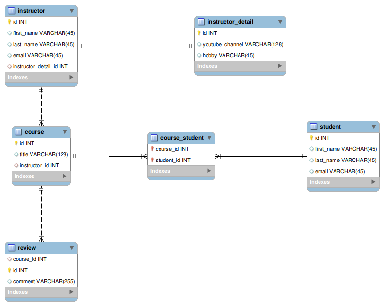
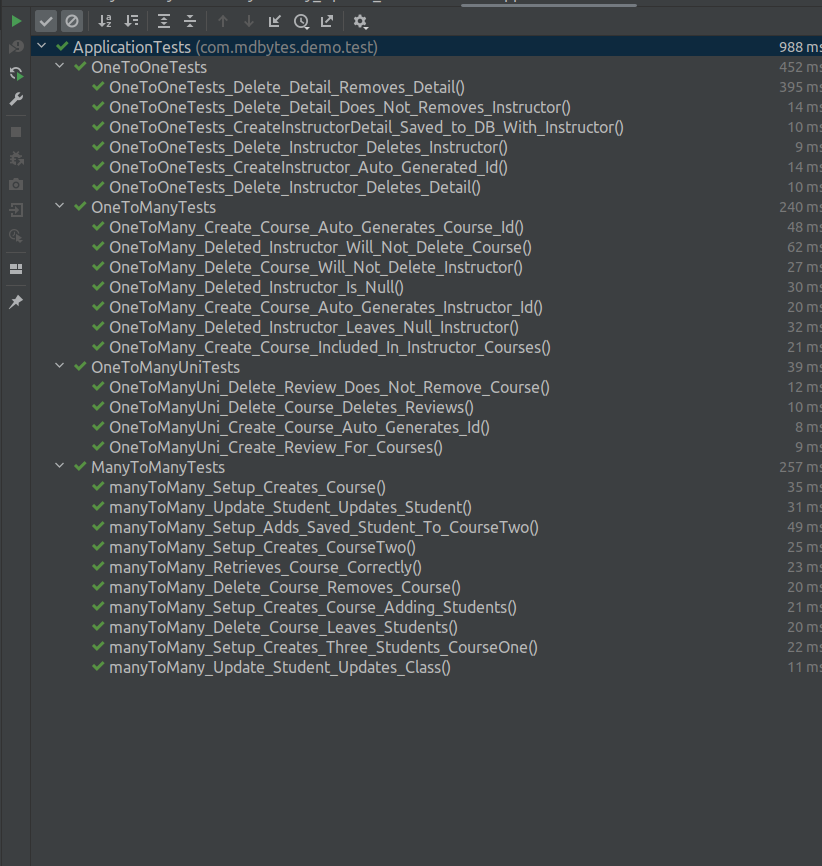

### Spring JPA: Hibernate Mappings with JUnit Testing

This project includes a demonstration of a Spring JPA project which utilizes Hibernate mappings, Spring JPA Repository with Service layer.  The mappings are then tested in JUnit with the help of an H2 in memory database.

There are some details related to the testing, the most impactful of which is the @DirtiesContext annotation on the test classes required to reset services after each test.

The simple database structure, with relationships, can be seen in the following Entity Diagram:

With results from the current JUnit tests:

Future updates to this repository will expand both relationships and testing.
